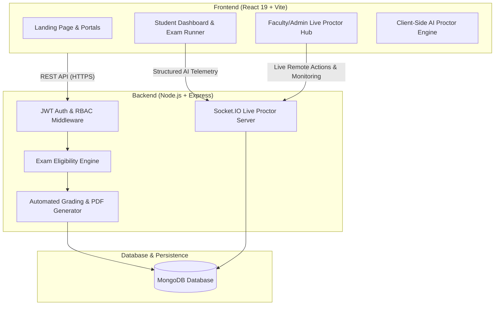

# 🎓 GLB EXAMSPHERE — Enterprise College Examination Cloud


**GLB EXAMSPHERE** is an institutional-grade, high-concurrency online examination and real-time proctoring platform engineered for universities, colleges, and educational institutes. It provides end-to-end management of the academic assessment lifecycle—from multi-dimensional cohort targeting and question bank management to AI-assisted browser/camera telemetry, live faculty oversight, instant evaluation, and tamper-resistant scorecard distribution.

---

## 🌟 Key Platform Capabilities

### 1. 🛡️ Institutional Security & Zero-Trust Architecture
- **Admin-Controlled Candidate Access**: Public self-registration is strictly disabled to prevent unvetted exam access. All student and faculty profiles are managed by institutional administrators.
- **Bulk Excel/CSV Student Roster Ingestion**: High-speed spreadsheet validation engine with row-by-row error reporting, automated conflict resolution, and duplicate detection.
- **Role-Based Access Control (RBAC)**: Strict separation between `ADMIN`, `TEACHER` (Faculty), and `STUDENT` roles enforced through cryptographically signed JWTs.
- **Rate-Limiting & Security Headers**: Built-in brute-force protection, helmet headers, and CORS security.

### 2. 🏛️ Multi-Dimensional Academic Hierarchy
- **Organizational Structure**: Granular mapping of Academic Years, Engineering/Degree Branches, Semesters, Sections, and Batches.
- **Targeting & Eligibility Engine**: Exams can be published with precision targeting:
  - `ENTIRE_COLLEGE`: Open to all authenticated students.
  - `BRANCH_YEAR`: Targeted to specific engineering departments and semester cohorts.
  - `SECTION_BATCH`: Precision targeting down to individual lab batches and class sections.
- **Scheduled Windows & Strict Deadlines**: Fixed start/end windows with auto-clamped attempt timers preventing candidates from exceeding official deadlines.

### 3. 👁️ Real-Time Anti-Cheat & Live Proctoring
- **Full-Screen Lockdown**: Detects window blur, tab switching, and window resizing in real time.
- **Client-Side AI Telemetry Engine**: Continuous browser-side analysis of candidate video/audio signals:
  - Face absence & multiple faces detection.
  - Eye-gaze deviation & head-pose orientation tracking.
  - Voice activity detection (VAD).
- **5-Strike Tab-Switch Auto-Submission**: Hard anti-tampering limit for repeated window/tab switching.
- **Live Faculty Monitoring Hub**: Real-time Socket.IO dashboard (`<300ms` latency) with live candidate telemetry status, remote timer adjustments (+5, +10 mins), proctor broadcast messaging, and manual disciplinary actions.
- **Privacy & Zero-Media Storage Guarantee**: Database stores only structured lightweight telemetry events; zero video/audio stream recordings or biometric face templates are retained.

### 4. 📝 Modern Question Authoring & Instant Grading
- **Versatile Question Types**: Single-Choice MCQs, Multi-Select Questions (MSQs) with exact-match logic, rich image attachments, and detailed step-by-step explanations.
- **Configurable Negative Marking**: Optional per-question penalty deduction for incorrect responses.
- **Tamper-Resistant PDF Scorecards**: Instant student performance breakdown with automated grade calculation and official institutional PDF report card generation.

---

## 🏗️ System Architecture



---

## 🚀 Quick Start Guide

### Prerequisites
- **Node.js**: v18.0.0 or higher
- **MongoDB**: Local instance running on port `27017` or MongoDB Atlas URI
- **npm** or **yarn**

### 1. Repository Setup
```bash
# Clone the repository
git clone https://github.com/your-org/glb-examsphere.git
cd glb-examsphere
```

### 2. Backend Installation & Configuration
```bash
cd backend
npm install

# Configure environment variables (.env)
cat <<EOF > .env
PORT=5000
MONGO_URI=mongodb://127.0.0.1:27017/glb_examsphere
JWT_SECRET=your_super_secret_jwt_encryption_key_2026
CLIENT_URL=http://localhost:5173
NODE_ENV=development
EOF

# Start backend server
npm run dev
```

### 3. Frontend Installation & Configuration
```bash
cd ../frontend
npm install

# Start Vite development server
npm run dev
```
Open [http://localhost:5173](http://localhost:5173) in your browser.

### 4. Populate Realistic Demo Data (Optional)
To immediately populate your local database with realistic institutional demo data (Admin, Faculty, Students, Academic hierarchy, 8 Exams, and 80 Question MCQs):

```bash
# Run demo seeder (idempotent and safe to run multiple times)
npm run seed:demo
# or from backend directory:
cd backend && npm run seed:demo
```

#### 🔑 Demo Credentials (Password for all accounts: `Demo@12345`)
| Role | Email | Profile & Scope |
| :--- | :--- | :--- |
| **Admin** | `demo.admin@glbexamsphere.test` | System Administrator (Full Institutional Access) |
| **Teacher 1** | `demo.teacher1@glbexamsphere.test` | CSE Faculty (DSA, DBMS, OS) |
| **Teacher 2** | `demo.teacher2@glbexamsphere.test` | AIML Faculty (Computer Networks, AI, ML) |
| **Student 1** | `demo.student01@glbexamsphere.test` | CSE Semester 5 Section A (Batch 2023-2027) |
| **Student 2** | `demo.student02@glbexamsphere.test` | CSE Semester 5 Section A (Batch 2023-2027) |
| **Student 5** | `demo.student05@glbexamsphere.test` | AIML Semester 5 Section A (Batch 2023-2027) |
| **Student 9** | `demo.student09@glbexamsphere.test` | CSE Semester 3 Section A (Batch 2024-2028) |
| **Student 10** | `demo.student10@glbexamsphere.test` | ECE Semester 3 Section A (Batch 2024-2028) |

---

## 🧪 Automated Regression & Testing

GLB EXAMSPHERE includes a comprehensive 86-test automated security and regression suite executing in-memory against MongoDB Memory Server.

```bash
cd backend
npm test
```

### Verification Highlights:
- **86/86 Automated Test Cases Passed (100% pass rate)**.
- Covers Phase 1 security, Phase 2 student bulk import & submission integrity, Phase 3 academic structure & eligibility calculations, and Phase 4 real-time proctoring lifecycles.

---

## 📚 Complete Documentation Suite

Detailed architectural specifications, role manuals, and operational guides are available in the [`docs/`](./docs) directory:

| Document | Description |
| :--- | :--- |
| [System Architecture](./docs/SYSTEM_ARCHITECTURE.md) | In-depth technical architecture, schemas, and security topology |
| [Admin Guide](./docs/ADMIN_GUIDE.md) | Complete manual for student roster imports, academic setup & system configuration |
| [Teacher / Faculty Guide](./docs/TEACHER_GUIDE.md) | Manual for exam authoring, question banks & live exam proctoring |
| [Student Guide](./docs/STUDENT_GUIDE.md) | Candidate examination walkthrough, system requirements & rules |
| [Proctoring & Anti-Cheat Engine](./docs/PROCTORING.md) | Client-side AI telemetry specifications, 5-strike rules & privacy disclosures |
| [Testing & QA Specifications](./docs/TESTING.md) | 86-test regression matrix, performance profiles & security audits |
| [Troubleshooting Guide](./docs/TROUBLESHOOTING.md) | Operational diagnosis, common error codes & resolution playbooks |

---

## 📄 License & Institutional Rights
&copy; 2026 GLB EXAMSPHERE. All rights reserved. Enterprise Educational Assessment Cloud.
