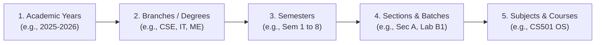

# ⚙️ GLB EXAMSPHERE — Administrator Operational Guide

## 1. Overview of Administrator Responsibilities

The **System Administrator** (`ADMIN`) possesses authoritative control over institutional configuration, academic hierarchy setup, student roster bulk ingestion, faculty role assignment, exam audits, and system-wide results oversight.

---

## 2. Academic Hierarchy Setup Workflow

Before publishing examinations or uploading student rosters, configure the academic master structure via **Admin Portal ➔ Academic Setup**:

### Step-by-Step Configuration:
1. **Academic Years**: Define the current active academic session (e.g., `2025-2026`, Code `AY2526`). Set `isCurrent: true` for the active year.
2. **Branches**: Define the degree programs (e.g., `Computer Science & Engineering`, Code `CSE`).
3. **Semesters**: Register valid academic terms (e.g., Semester 1 through 8).
4. **Sections**: Define class groupings per branch (e.g., `Section A`, `Section B`).
5. **Batches**: Create lab cohorts (e.g., `Batch 1`, `Batch 2`).
6. **Subjects**: Assign official subject titles and codes (e.g., `Distributed Systems`, Code `CS702`) tied to specific branches and semesters.

---

## 3. Student Roster Management & Bulk Import

### 3.1 Bulk Spreadsheet Ingestion Workflow
Navigate to **Admin Portal ➔ Students ➔ Bulk Import Students**. The system executes a 4-step ingestion pipeline:

1. **Step 1: File Upload & Template Download**:
   - Download the official `.xlsx` / `.csv` template.
   - Required Columns: `name`, `email`, `rollNumber`, `enrollmentNumber`, `branch`, `semester`, `section`, `batch`, `password` (Optional, defaults to standard initial password).
2. **Step 2: Client & Server Pre-Validation**:
   - The validation engine scans all rows for:
     - Missing mandatory fields.
     - Email formatting and in-file duplicate emails/roll numbers.
     - Academic code validity against the database master records.
   - Color-coded preview displays: Valid rows (Green), Warning rows (Yellow), and Fatal errors (Red).
3. **Step 3: Ingestion & Conflict Resolution**:
   - Choose conflict policy: `Skip Duplicates` or `Update Existing Records`.
   - Click **Execute Ingestion**.
4. **Step 4: Audit Summary & Error Download**:
   - Immediate report displaying Total Rows, Inserted Count, Skipped Count, and Failed Count with downloadable CSV error logs.

---

## 4. Faculty & Teacher Role Management

Navigate to **Admin Portal ➔ Teachers**:
1. **Create Faculty Account**: Add teacher name, institutional email, department, and contact info.
2. **Assign Academic Scopes**:
   - Assign specific subjects taught by the faculty member.
   - Assign branch/semester cohorts they are authorized to test.
   - Set administrative override flags (`canTargetEntireCollege`, `canManageAllSubjects`) if the faculty member coordinates multi-departmental exams.
3. **Credential Administration**: Trigger one-click secure password resets or deactivate faculty access when required.

---

## 5. Live Proctoring Oversight & System Audit

Administrators have global visibility across all active examination sessions in **Admin Portal ➔ Live Proctoring**:
- Filter active candidate cards by Exam, Branch, or Proctoring Status.
- View real-time webcams, strike warning counters, and active AI flags.
- Remotely broadcast urgent announcements to all active candidates.
- Review historical proctoring audit logs, tab-switch timelines, and disqualified candidate histories.
