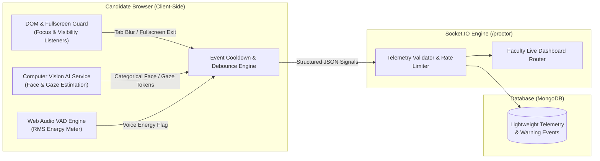

# 🛡️ GLB EXAMSPHERE — Proctoring & Anti-Tampering Engine

## 1. Proctoring System Architecture

GLB EXAMSPHERE implements a **privacy-first, client-side proctoring architecture** designed for high scalability, real-time integrity verification, and strict candidate privacy:

---

## 2. Telemetry Ingestion Signals & Factual Indicators

All computer vision and audio analysis is executed entirely **within the candidate's browser**. The server receives only lightweight, structured categorical event tokens:

| Signal Type | Client-Side Trigger | Server Ingestion Event | Severity | Action & Display |
| :--- | :--- | :--- | :--- | :--- |
| **Window Focus Loss** | `window.onblur` / `visibilitychange` | `TAB_HIDDEN` / `WINDOW_BLUR` | `MEDIUM` | Client strike increment + Warning modal |
| **Fullscreen Exit** | `fullscreenchange` DOM event | `FULLSCREEN_EXITED` | `HIGH` | Client strike increment + Fullscreen restore modal |
| **Face Absence** | Face absent for > 2.5s | `FACE_LOST` | `MEDIUM` | Factual banner: *"Your face is not visible. Please remain in camera view."* |
| **Multiple Faces** | Multi-face tensor detected for > 2.0s | `MULTIPLE_FACES_DETECTED` | `HIGH` | Factual notice: *"Multiple faces detected. Ensure you are alone."* |
| **Gaze Deviation** | Iris direction deviated for > 3.0s | `GAZE_AWAY` | `LOW` | Factual telemetry notice: *"Frequent gaze deviation detected."* |
| **Head Pose Away** | Head pitch/yaw rotated for > 3.0s | `HEAD_AWAY` | `LOW` | Factual telemetry notice: *"Head movement away from screen detected."* |
| **Voice Activity** | Audio RMS energy sustained for > 1.5s | `VOICE_ACTIVITY_STARTED` | `LOW` | Informational audit flag for faculty review |

---

## 3. Strike Warning Engine & Tiered Thresholds

### 3.1 Browser Focus & Anti-Tampering Limit (5 Strikes)
- Repeatedly switching browser tabs or exiting fullscreen mode directly undermines examination isolation.
- The exam runner tracks unmaximized window blurs and tab changes.
- **Upon receiving 5 tab-switch / window-blur strikes**, the application enforces automatic submission of the candidate's exam to prevent unauthorized external tool usage.

### 3.2 AI Telemetry Warnings & Faculty Oversight
- AI-assisted computer vision signals (such as temporary gaze deviation or head rotation) generate **informational warnings** for instructor review.
- **AI telemetry NEVER automatically labels a student as "CHEATING CONFIRMED"** and does NOT automatically disqualify a candidate without instructor oversight.
- Faculty and administrators supervise candidates in real time via the Live Proctoring Dashboard, reviewing timestamped warning logs and determining appropriate disciplinary action if warranted.

---

## 4. Privacy & Zero-Media Storage Guarantee

1. **Zero Video / Audio Storage**: Candidate camera video feeds and microphone audio streams are processed solely in volatile browser RAM. **Zero video clips (`.mp4`, `.webm`), audio files (`.wav`), or raw frame bitmaps are stored in the database or server filesystem.**
2. **Zero Biometric Identity Storage**: No facial recognition templates, face coordinate embeddings, or biometric identity profiles are constructed, transmitted, or retained.
3. **Structured Audit Logs Only**: The database records only lightweight structured JSON events (e.g., `{ "eventType": "FACE_LOST", "timestamp": "2026-09-25T14:30:00Z" }`) for administrative audit compliance.
