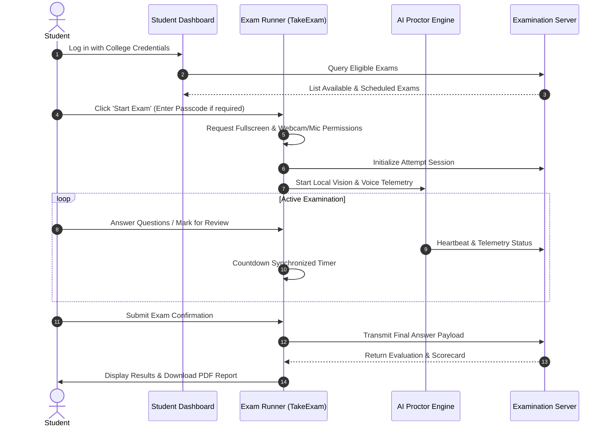

# 👨‍🎓 GLB EXAMSPHERE — Student Examination Manual

## 1. Candidate Environment & System Requirements

Before beginning an examination on GLB EXAMSPHERE, verify your system meets the following standard specifications:

| Component | Minimum Requirement | Recommended |
| :--- | :--- | :--- |
| **Device** | Laptop / Desktop PC | Modern laptop with integrated webcam |
| **Operating System** | Windows 10/11, macOS 12+, Ubuntu 20.04+ | Windows 11 / macOS Latest |
| **Browser** | Google Chrome 110+, Edge 110+, Firefox 115+ | Google Chrome (Latest Stable) |
| **Peripherals** | Functional Webcam & Microphone | HD 720p Webcam & Clear Microphone |
| **Network** | Stable 1 Mbps broadband connection | Stable 5+ Mbps WiFi or Ethernet |

---

## 2. Examination Lifecycle Walkthrough

---

## 3. Examination Screen Controls & Status Legend

While taking an exam:
- **Top Bar**: Displays the synchronized countdown timer, overall progress counter, camera status indicator, and fullscreen status.
- **Question Palette**: Color-coded matrix allowing fast navigation:
  - 🟩 **Green**: Answered.
  - 🟨 **Yellow**: Marked for Review.
  - ⬜ **Gray**: Unanswered / Skipped.
  - 🟦 **Blue Border**: Current Active Question.
- **Answer Selection**:
  - Click a radio option for Single Choice questions.
  - Click checkboxes for Multi-Select questions.
  - Click **Clear Selection** to remove an accidental click.
- **Review Toggle**: Click **Bookmark / Mark for Review** to easily return to complex questions before submitting.

---

## 4. Anti-Cheating Rules & Strike Warnings

To maintain academic integrity, GLB EXAMSPHERE monitors the examination environment:

### ⚠️ Actions that Trigger Tab-Switch Strikes:
1. **Exiting Fullscreen Mode**: Pressing `Esc` or unmaximizing the browser window.
2. **Tab Switching & Application Blur**: Opening a new browser tab, minimizing the window, or switching to another application.

### 🛑 5-Strike Tab-Switch Rule:
- Each tab switch or fullscreen exit increments your strike counter and displays an immediate warning modal.
- You must acknowledge the notice to return to full-screen mode.
- **Upon reaching 5 strikes**, the examination is automatically locked and submitted.

### 👁️ AI Presence & Gaze Guidance:
- If your face moves outside camera view, another person enters the frame, or significant gaze deviation occurs, a factual on-screen reminder banner will appear to guide you back into frame.
- AI telemetry does NOT automatically label you as cheating or disqualify you; it logs structured status events for faculty review.

---

## 5. Submitting & Viewing Results

1. When you finish all questions, click the green **Submit Exam** button.
2. A summary confirmation dialog will show the count of answered, unanswered, and reviewed questions.
3. Click **Confirm & Submit**.
4. You will immediately be redirected to your **Result Scorecard** featuring:
   - Total Marks, Percentage, and Pass/Fail Status.
   - Question-by-question review with correct answers and detailed explanations (if released by your instructor).
   - **Download Official PDF Report Card** button for your academic records.
