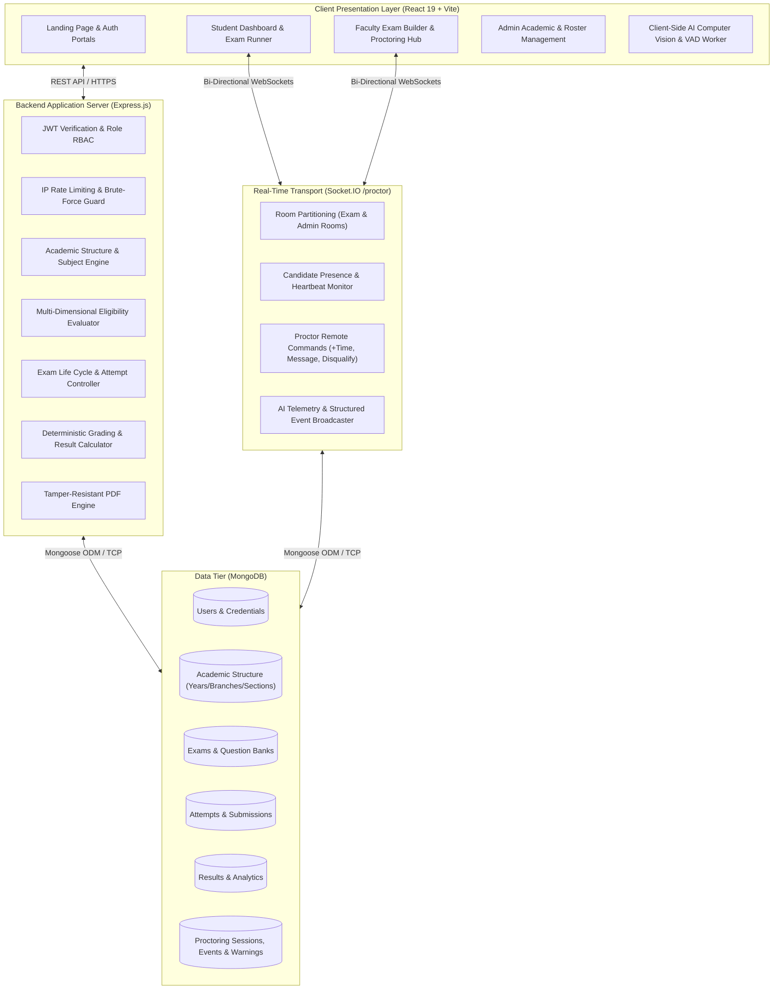

# 🏛️ GLB EXAMSPHERE — System Architecture & Technical Design

## 1. Executive Architecture Summary

GLB EXAMSPHERE is architected as a modular, secure, high-concurrency client-server web application adhering to the MERN stack (MongoDB, Express.js, React 19, Node.js) with real-time bi-directional WebSocket channels powered by Socket.IO.

The platform is designed to guarantee:
1. **Zero-Trust Candidate Verification**: Strict admin-managed access with disabled public self-registration.
2. **Real-Time Client-Side AI Telemetry**: Real-time presence, gaze, head-pose, and audio energy analysis executed locally within the student's browser with sub-second WebSocket dispatch (`<300ms`).
3. **Multi-Dimensional Cohort Isolation**: Precision academic targeting preventing unauthorized candidate attempts across departments, semesters, and lab batches.
4. **Data Privacy by Design**: Zero raw media (video/audio) or biometric template storage on server disks or databases.

---

## 2. High-Level Architecture Diagram



---

## 3. Core Database Schemas & Relationships

### 3.1 User Model (`User.js`)
- `name`: Full candidate/faculty name (String, Required).
- `email`: Normalized lowercase college email (String, Unique, Indexed).
- `password`: Bcrypt-hashed password (cost factor 10).
- `role`: Enum `['ADMIN', 'TEACHER', 'STUDENT']`.
- `status`: Enum `['ACTIVE', 'INACTIVE', 'SUSPENDED']`.
- `academicProfile`:
  - `branch`: ObjectId ref to `Branch`.
  - `semester`: ObjectId ref to `Semester`.
  - `section`: ObjectId ref to `Section`.
  - `batch`: ObjectId ref to `Batch`.
  - `rollNumber`: String (Unique per cohort).
  - `enrollmentNumber`: String (Unique institutional ID).
- `teacherProfile`:
  - `department`: ObjectId ref to `Branch`.
  - `assignedSubjects`: Array of ObjectId refs to `Subject`.
  - `assignedAcademicGroups`: Mappings to AcademicYears, Branches, Semesters, Sections.
  - `permissions`: Flags for `canTargetEntireCollege`, `canManageAllSubjects`.

### 3.2 Exam Model (`Exam.js`)
- `title`: String.
- `description`: String.
- `duration`: Number (in minutes).
- `passMarks`: Number.
- `isScheduled`: Boolean.
- `startTime`: Date (Optional ISO timestamp).
- `endTime`: Date (Optional ISO timestamp).
- `audienceType`: Enum `['ENTIRE_COLLEGE', 'BRANCH_YEAR', 'SECTION_BATCH']`.
- `target`:
  - `academicYears`: Array of refs.
  - `branches`: Array of refs.
  - `semesters`: Array of refs.
  - `sections`: Array of refs.
  - `batches`: Array of refs.
- `subjectId`: ObjectId ref to `Subject`.
- `createdBy`: ObjectId ref to `User`.
- `requireCamera`: Boolean (enforces proctoring requirements).
- `hasAccessCode`: Boolean.
- `accessCode`: String (hashed or validated on attempt initialization).
- `isPublished`: Boolean.

### 3.3 Question Model (`Question.js`)
- `examId`: ObjectId ref to `Exam` (Indexed).
- `questionText`: String.
- `questionImage`: String URL (Optional).
- `questionType`: Enum `['SINGLE', 'MULTIPLE']`.
- `options`: Array of Strings (min 2, max 6).
- `correctAnswer`: String or Array of Strings.
- `marks`: Number (Positive integer/float).
- `negativeMarks`: Number (Optional penalty).
- `explanation`: Rich text rationale rendered post-submission.

### 3.4 ExamAttempt Model (`ExamAttempt.js`)
- `examId`: ObjectId ref to `Exam`.
- `studentId`: ObjectId ref to `User`.
- `attemptNumber`: Number (Default 1).
- `status`: Enum `['IN_PROGRESS', 'SUBMITTED', 'DISQUALIFIED', 'TIMED_OUT']`.
- `startTime`: Date.
- `lastHeartbeat`: Date.
- `submissionTime`: Date.
- `allocatedDuration`: Number (includes base duration + dynamically granted extra minutes).
- `warningCount`: Number (tracked from 0 to 5).
- `answers`: Array of `{ questionId, selectedOptions, isMarkedForReview }`.

### 3.5 Proctoring Models (`ProctoringSession.js`, `ProctoringEvent.js`, `ProctoringWarning.js`)
- `ProctoringSession`: Tracks overall active socket presence, camera health (`ACTIVE`, `LOST`, `FAILED`), microphone status, client IP, browser user-agent, and lifecycle state (`INITIALIZED`, `ACTIVE`, `ENDED`).
- `ProctoringEvent`: High-frequency audit trail storing timestamped telemetry types:
  - `TAB_BLUR`, `WINDOW_RESIZE`, `FULLSCREEN_EXIT`.
  - `FACE_NOT_DETECTED`, `MULTIPLE_FACES_DETECTED`.
  - `GAZE_AWAY_LEFT`, `GAZE_AWAY_RIGHT`, `HEAD_DOWN`, `HEAD_UP`.
  - `VOICE_DETECTED`.
- `ProctoringWarning`: Formally issued warnings with strike numbers (1 to 5), trigger causes, and faculty acknowledgement status.

---

## 4. Multi-Dimensional Eligibility Engine Logic

When a student queries `/api/exams` or attempts to initialize an exam session via `/api/exams/:id/start`, the backend executes the deterministic eligibility validator:

```text
1. Is the exam published?
   -> NO: Reject (404 Not Found)
2. Is the student's status ACTIVE?
   -> NO: Reject (403 Account Suspended)
3. Check Target Audience:
   - If audienceType == 'ENTIRE_COLLEGE':
       -> Pass
   - If audienceType == 'BRANCH_YEAR':
       -> Check if student.branch in target.branches
       -> Check if student.semester in target.semesters
       -> If any match fails -> Reject (403 Not Eligible)
   - If audienceType == 'SECTION_BATCH':
       -> Check if student.section in target.sections
       -> Check if student.batch in target.batches
       -> If any match fails -> Reject (403 Not Eligible)
4. Check Schedule Window:
   - If now < exam.startTime:
       -> Reject with { status: 'UPCOMING', startTime }
   - If now > exam.endTime:
       -> Reject with { status: 'EXPIRED', endTime }
   - If exam.startTime <= now <= exam.endTime:
       -> Calculate remaining window time: windowRemaining = (endTime - now)
       -> Effective duration = min(exam.duration * 60, windowRemaining)
5. Check Attempt Limits:
   - If existing attempt exists with status == 'SUBMITTED' and !exam.allowMultipleAttempts:
       -> Reject (400 Already Submitted)
```

---

## 5. Security & Privacy Guarantees

1. **Zero Raw Media Retention**: No candidate video stream chunks, audio WAV files, or face biometric coordinate embeddings are written to persistent storage. All AI analysis is performed on the candidate's browser worker thread, and only categorical telemetry tokens (e.g., `FACE_NOT_DETECTED`) are transmitted to the backend.
2. **Timing-Safe Credential Verification**: Passwords and access codes use bcrypt compare functions to eliminate timing attack vectors.
3. **Session Token Invalidation**: Logout requests and proctoring disqualifications invalidate JWT sessions via distributed token blacklisting.
