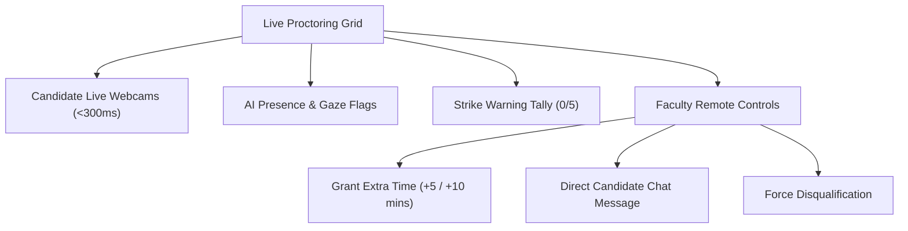

# 👩‍🏫 GLB EXAMSPHERE — Faculty & Teacher User Guide

## 1. Overview of Faculty Capabilities

The **Teacher / Faculty** portal provides instructors with tools to create structured assessments, upload question banks, monitor students during live tests, dynamically adjust exam time, and generate official institutional grade reports.

---

## 2. Authoring & Configuring Examinations

Navigate to **Faculty Portal ➔ Create Exam**:

### 2.1 Basic Parameters & Scoring
- **Exam Title & Description**: State the course assessment name and instructions clearly.
- **Subject Association**: Select from your assigned subjects.
- **Duration (Minutes)**: Total time allocated to complete the attempt.
- **Passing Marks**: Minimum required score to earn a passing status.
- **Negative Marking**: Enable optional penalties (e.g., `-0.25` or `-0.50` marks per wrong answer) to deter random guessing.

### 2.2 Schedule Windows & Security Locks
- **Scheduled Window**:
  - `startTime`: Exact ISO date/time the exam unlocks for students.
  - `endTime`: Hard cutoff date/time after which no new attempts may start and active attempts are force-submitted.
- **Passcode Protection**: Enable access codes if you require an in-person room proctor to disclose the key upon exam commencement.
- **Mandatory Camera Requirement**: Enforce webcam and microphone initialization before questions load.

### 2.3 Cohort Targeting Configuration
Select the target audience:
- **Entire College**: Available to all registered students.
- **Department Cohorts (`BRANCH_YEAR`)**: Choose your department (e.g., `Information Technology`) and target semesters (e.g., `Semester 6`).
- **Class Cohorts (`SECTION_BATCH`)**: Narrow down to specific sections (e.g., `Section A`) or lab batches (e.g., `Batch B1`).

---

## 3. Question Bank Management

Navigate to **Manage Questions** for your exam:

### 3.1 Supported Question Types
1. **Single Choice MCQ**: 1 correct answer among 2–6 selectable options.
2. **Multi-Select Question (MSQ)**: Multiple correct answers requiring full exact-match selection to earn positive marks.
3. **Question Diagrams & Images**: Attach high-resolution diagrams and schematics directly to questions.
4. **Explanations & Rationales**: Provide pedagogical reasoning displayed on the student scorecard after submission.

### 3.2 Automated PDF Question Bank Extraction
- Click **Upload Question Paper (PDF)**.
- The extraction engine parses questions, options, and designated answer keys automatically into the authoring grid for quick review and approval.

---

## 4. Live Proctoring & Real-Time Candidate Oversight

During an active assessment, open **Faculty Portal ➔ Live Proctoring**:

### Remote Action Controls:
- **Grant Extra Time**: Single-click button to add `+5` or `+10` minutes to an individual candidate experiencing documented hardware or network delays.
- **Send Candidate Message**: Dispatch an instant dismissible overlay notification to a student's screen (e.g., *"Please adjust your webcam to center your face"*).
- **Manual Disqualification**: Immediately terminate an attempt and record a disciplinary violation with full timestamped audit logs.
